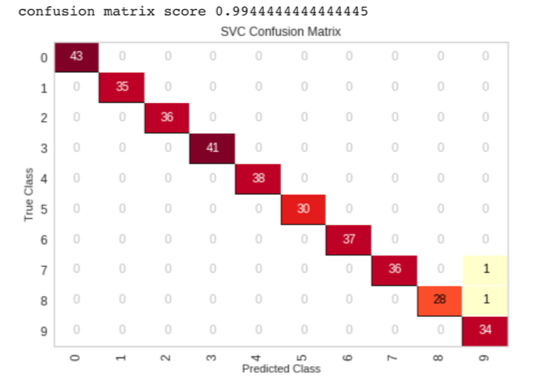

# Machine_Learning_Model_Selector

## By: William Gao

## Kernel Access: https://colab.research.google.com/drive/1Z9YaYASlE2snHHEaD7DdSyDRGrtPkwll

### Overview

Classification is one of the most used case in machine learning. In this project, I started applying 
A Support Vector Machine (SVM) model to a set of images, then predict the remaining images based on the trained model. After testing, I decided to build a machine learning model selector that auto select the best classification model with the highest R-square. As a result, after cross validation, the best machine learning model in this sets of digit images are the SCM-SVC model that yields 99.44% accuracy after a 6-fold cross validation. 
Data-Image

 
### Techniques and Procedure
#### Steps
... I build a function that split data using train_test_split module in sklearn library and assign 80% of the data as training set and the remaining 20% as testing set. Then I define the random state default to 42 – a number normally used in data split. Further analysis on optimizing random state can be found in one of my previous research.  

... The function also takes in models as an argument to trained with split datasets. A Yellowbrick confusion matrix is later used to visualize results from predicted values against actual values from each model. Refer to the confusion matrix, we can clear see the misclassification is fairly low.

Models tested:

 
... In order to obtain a more accurate evaluation of the test results, sklearn cross validation is used here to improve the generalization of the test result. At the end of the evaluation. A report and scatter plot are used to illustrate the results. The chart on the right shows the prediction vs actual value after 6-fold cross validation, we can see a pattern that results are line up with the diagonal which is good.  

### Conclusion 
With the R-Square of 0.95 and close to 100% accuracy and recall from cross validation, the model SVM.SVC triumphed among the tested models. Therefore, I suggest to start with SVM.SVC model when working on image classification problems. 

